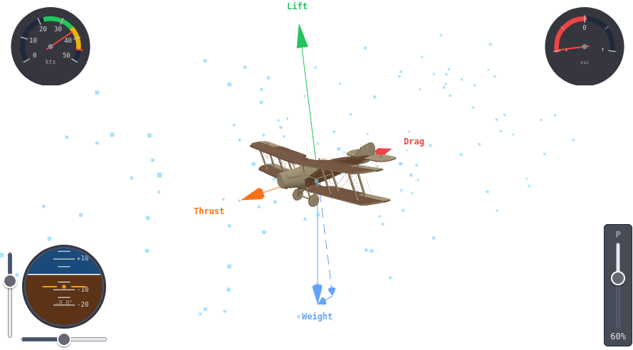

These are interactive training tools that run directly in your browser — no installation needed. Each one visualises an aviation concept so you can explore it hands-on, whether you're an instructor preparing a ground briefing or a trainee working through theory at home.

All tools on this site are free to use and free to embed in your own training materials. Any improvements made to them must be shared back with the community.

---

## Four Forces

An interactive 3D view of the four forces acting on an aircraft in flight. Adjust the throttle and pitch attitude using on-screen sliders and watch the lift, weight, thrust, and drag arrows respond in real time — showing how each force changes with speed and attitude.

Useful for demonstrating how an aircraft climbs, descends, or holds level flight, and for exploring what happens when the balance of forces breaks down.

[Explore Four Forces →](/learning-components/four-forces/)
